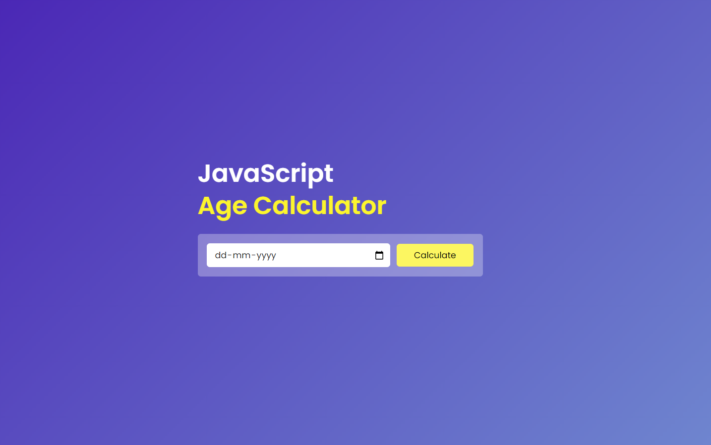
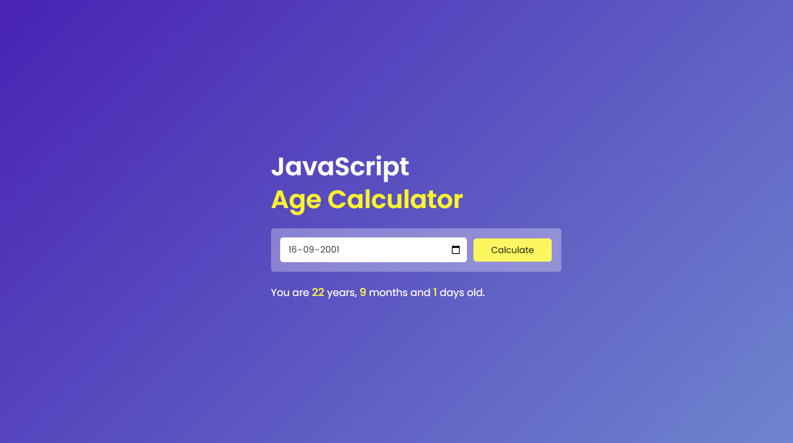

# Age Calculator

A simple and interactive age calculator application built with HTML, CSS, and JavaScript. This app allows users to input their birthdate and get the result in days, months, and years.

## Visit the Website

[Age Calculator](https://maheshhattimare.github.io/age-calculator/)

## Features

- User-friendly interface
- Calculates age in days, months, and years

## Technologies Used

- HTML
- CSS
- JavaScript

## Screenshots

### Interface


### Result


## Installation

1. Clone the repository:
    ```bash
    git clone https://github.com/maheshhattimare/age-calculator.git
    ```
2. Navigate to the project directory:
    ```bash
    cd age-calculator
    ```
3. Open `index.html` in your web browser to start the application.

## Usage

1. Open the `index.html` file in your preferred web browser.
2. Enter your birthdate by clicking on the calendar button.
3. Click on the "Calculate" button to get the result.

